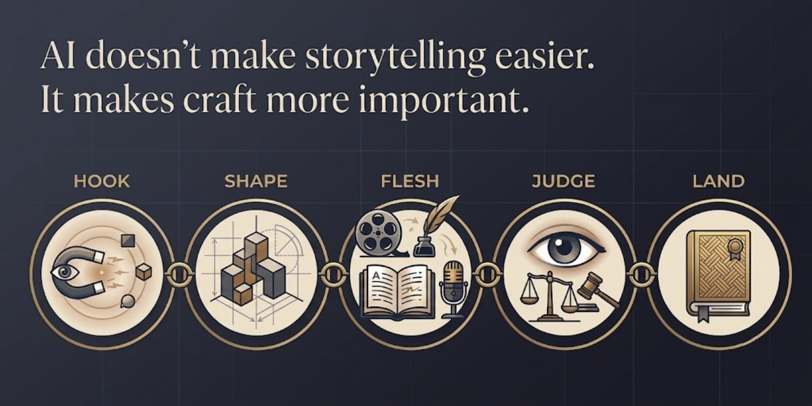

# 🎭 Be a Storyteller

[](https://agentskills.io)
[](LICENSE)
[](CONTRIBUTING.md)

> Tell better stories. Teach others too. **Your AI Agent makes it possible.**
> Hundreds of masters across centuries. I curated their best. Your agent delivers it actively: reading your drafts, interviewing you when you're stuck, and forcing you to rewrite.



## Install

```bash
npx skills add ringofai/storyteller
```

Then ask your agent:

> *"I have a 2-minute presentation tomorrow. Help me structure it."*  
> *"Give me an exercise to improve my pitch."*  
> *"Walk me through the hook stage for [topic]."*

---

## What You Can Do in 5 Minutes

Install the skill, then try any of these:

**Fix a weak opening (2 minutes)**
Ask your agent: *"I need to open a presentation about [topic]. Walk me through the hook exercise."*
→ You'll have a one-line hook before you finish reading this page.

**Test if your story works (3 minutes)**
Ask your agent: *"Here's my story. Run the four checks from the Judge stage."*
→ You'll know exactly what to cut and what to strengthen.

**Improve your delivery (90 seconds)**
Ask your agent: *"Give me the vocal warm-up for a presentation I'm giving today."*
→ You'll sound more confident in the time it takes to brew coffee.

---

## This vs Everything Else

| You could... | And get... | Or install this and get... |
|:-------------|:-----------|:---------------------------|
| Read *Made to Stick* | One great framework, 3 hours | The same framework + 24 others, delivered by your agent in 2 minutes |
| Watch 5 TED talks | 5 insights, no coherence | All 5 insights, sequenced and tested, with exercises and checkpoints |
| Take a $500 storytelling course | One perspective, fixed schedule | Dozens of perspectives, on demand, for $0 |
| Ask ChatGPT for storytelling tips | A polite, passive chatbot | An active coach that reads your files, interrogates your ideas, and forces you to rewrite |

---

## What You Can Do With This

**Get actively coached, not just advised.** Most skills turn your AI into a chatbot. This skill turns it into an active workspace collaborator. It is instructed to read your slide decks, use Socratic questioning to drag the hook out of you when you're frozen, and force you into a "Refactor Loop" when your tension drops.

**Run a workshop for your team or students.** The blueprint, rubrics, and prompts are built in. Open the skill, tell your agent who you're teaching and how long you have, and get a session plan.

**Practice on your own.** Work through the five stages at your own pace. Each stage has an exercise, a prompt, and a checkpoint. No teacher needed.

**Build your creative judgement.** The skill doesn't just help you produce stories. It helps you evaluate them — yours and others'. That ability to discern what works and why is what separates good storytellers from great ones.

---

## Who It's For

**Students & self-learners** — Get coached through 5 stages. Practice exercises, feedback checkpoints, no teacher needed.

**Educators & trainers** — Design workshops and courses without starting from scratch. Blueprints, rubrics, and bilingual notes are ready to use.

**Professionals & creators** — Get coached before a pitch or presentation. Then use the framework to train your team or audience.

---

## What's Inside

| Stage | What You'll Have at the End |
|:------|:----------------------------|
| **HOOK** | A one-line hook that makes people want to listen |
| **SHAPE** | A three-act outline with a character who wants something |
| **FLESH** | A script with sensory detail, metaphor, and vulnerability |
| **JUDGE** | Clear feedback on what's working and what to cut |
| **LAND** | A delivery you've practised — with voice, pace, and presence |

This draws on 25+ frameworks across books, TED talks, and YouTube. Full details in `SKILL.md`. Why each framework was chosen in `docs/design-philosophy.md`.

---

## What Makes This Work

The best storytelling wisdom already exists — Aristotle on structure, Duarte on tension, Stanton on character, Brown on vulnerability, Treasure on delivery. Each solved one piece. This skill brings them together in a sequence that works: hook first, then shape, then flesh, then judge, then land.

But having the wisdom isn't enough. It's about **how the AI Agent delivers it**. This skill is not a passive PDF. It contains strict behavioral directives so the agent acts like a master coach: reading your context before you type, interviewing you when you freeze, and refusing to let you advance until you've rewritten weak scenes.

### Why These Masters, Not Others

There are hundreds of storytelling frameworks across centuries of human tradition. Not all of them made the cut. The Hero's Journey is brilliant for analysis but confusing for beginners. Truby's 22 steps are comprehensive but overwhelming in a 45-minute class. Snyder's 15 beats were designed for 90-minute films, not classroom presentations.

The masters in this skill — pulled from ancient philosophy, modern advertising, Pixar, TED, neuroscience, vocal training, and YouTube — were chosen because each solves a specific problem at a specific stage, and each is teachable. That's the difference between a library and a curriculum. A library gives you everything. A curriculum gives you what works, in the right order, with nothing that distracts.

I spent 20+ years in creative communication and consulting, and lecture communication at a world top 50 university. This skill is the result of that judgement — which masters to include, which to leave out, and how to sequence them so your agent can coach anyone through every stage.

---

## ⭐ Like This?

Star the repo. Contributions welcome — see [CONTRIBUTING.md](CONTRIBUTING.md).

---

## License

[CC BY 4.0](LICENSE) — Free to share and adapt with attribution to Ringo Fai.
